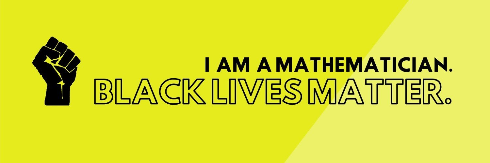

# The World of Mathematics

Welcome! This site is an attempt to feature some of my favorite math resources on the Web, so without further ado, let's get started!

- [**Mathematics — Wikipedia**](#): This is the de-facto portal of mathematics on the Web, and features a story of mathematics that is incredibly fascinating. When mathemaics reads like a novel, you know that it got to be good. And this happens to be one of them.
- [**The Glossary of Higher Mathematical Jargon**](https://mathvault.ca/math-glossary/): When you want to learn some serious math but have no clue where to start, what do you do? Well, you start with its language of course — more specifically the jargon of mathematics. When it comes to these words, this guide is definitely not in the lacking. If anything, it will take you on a ride from "abstract nonsense" all the way to "without loss of generality".
- [**Introduction to Higher Mathematics**](https://www.youtube.com/playlist?list=PLZzHxk_TPOStgPtqRZ6KzmkUQBQ8TSWVX): When it comes to math beyond the K-12 level, videos are often not the type of modality. But alas, there are times where math videos can strike gold, and this is one of them. Organized as a 19-part series, this resource will venture into an abstract world which you might or might not have seen. From proof, logic, set theory, relation to number theory, modular arithmetic, topology and ring theory, it seems that there's enough of mathematical goodness for just about everyone.

All right folks. These resources should keep you busy for a while already. So until next time and may Math be your lord and shepherd many years down the road!
{: .text-danger}

## Table of Contents

Done manually in Markdown using autogenerated anchors.

- [Text Ornaments](#text-ornaments)
- [Text Alignment](#text-alignment)
- [Columns](#columns)
- [Lists](#lists)
- [Preformatted Text](#preformatted-text)
- [Blockquotes](#blockquotes)
- [Colorboxes](#colorboxes)
- [Badges](#badges)
- [Buttons](#buttons)
- [Button Groups](#button-groups)
- [List Groups](#list-groups)
- [Tabs](#tabs)
- [Navigation Bar](#navigation-bar)

### Table of Contents using Kramdown commands

- TOC
{:toc}

## Text Ornaments

**Bold text** makes *emphasize* or ~~deleted~~ text to shame. <u>Underline</u> using `<u>`, <mark>highlight</mark> with `<mark>` and <small>make texts smaller</small> with `<small>`. [link](#) works as usual. Wrap URL around `<>` to generate link (like <https://mathvault.ca>).

### Colors

For <span class="text-primary">colored texts</span>, use `.text-primary` and the like.

For [colored links](){: .link-secondary}, use `.link-secondary` or the like instead.

For colored-background texts, use `bg-success` `.text-white` and the like.
{: .p-3 .bg-success .text-white}

### Text Transforms

This is .text-uppercase
{: .text-uppercase} 
This is .text-lowercase.
{: .text-lowercase}
This is .text-capitalize
{: .text-capitalize}

### Font Weights

.font-weight-lighter
{: .font-weight-lighter}
.font-weight-light
{: .font-weight-light}
.font-weight-normal
{: .font-weight-normal}
.font-weight-bold
{: .font-weight-bold}
.font-weight-bolder
{: .font-weight-bolder}

### Paddings

<span class="p-1 bg-primary text-white">.p-1 class</span> <span class="p-2 bg-secondary text-white">.p-2 class</span> <span class="p-3 bg-success text-white">.p-3 class</span> <span class="p-4 bg-warning text-white">.p-4 class</span> <span class="p-5 bg-danger text-white">.p-5 class</span>

### Display options

Use `.d-inline` to display as inline.
{: .d-inline .bg-primary .text-white}
Use `.d-block` to display as block.
{: .d-block .bg-secondary .text-white}

For flexboxes, use `.d-flex`

Use `.d-none` to hide on all devices

## Width and Height

This is `w-25`
{: .bg-primary .text-white .p-3 .w-25}

This is `w-50`
{: .bg-primary  .text-white .p-3 .w-50}

This is `w-75`
{: .bg-primary  .text-white .p-3 .w-75}

This is `w-100`
{: .bg-primary  .text-white .p-3 .w-100}

This is `w-auto`
{: .bg-primary  .text-white .p-3 .w-auto}

This is `h-25`
{: .bg-primary  .text-white .p-3 .h-25}

## Embedding Markdown

To enable embedding Markdown in HTML, use `{::options parse_block_html="true" /}`.

Disable embedding with `{::options parse_block_html="false" /}`.

## Text Alignment

This paragraph is centered using `.text-center` class.
{: .text-center}

This paragraph is aligned to the right using `.text-right` class.
{: .text-right}

<span class="align-top"> This is .align-top</span> <span class="align-middle">This is .align-middle</span> <span class="align-bottom">This is .align-bottom</span> 


## Heading 2 with `{: .text-primary .font-weight-bolder #abc}`
{: .text-primary .font-weight-bolder #abc}

### Heading 3

<h3>
  Fancy display heading
  <small class="text-muted">With faded secondary text</small>
</h3>

#### Heading 4

##### Heading 5

###### Heading 6

<h1 class="display-1">Display 1</h1>
<h1 class="display-2">Display 2</h1>
<h1 class="display-3">Display 3</h1>
<h1 class="display-4">Display 4</h1>

## Columns

### 3 Columns

<div class="container">
  <div class="row">
    <div class="col-sm"> <strong>Column 1</strong> </div>
    <div class="col-sm"> Column 2</div>
    <div class="col-sm"> Column 3</div>
  </div>
</div>

### Any columns (`.container` > `.row` > `.col`)

<div class="container">
  <div class="row">
    <div class="col"> Column 1 </div>
    <div class="col"> Column 2 (Width is auto-adjusted) </div>
    <div class="col"> Column 3</div>
  </div>
</div>

### Specify 4 columns with `.row-cols-4`

<div class="container">
  <div class="row row-cols-4">
    <div class="col"> Column 1 </div>
    <div class="col"> Column 2 (Width is auto-adjusted) </div>
    <div class="col"> Column 3</div>
    <div class="col"> Column 4</div>
    <div class="col"> Column 1 </div>
    <div class="col"> Column 2 (Width is auto-adjusted) </div>
    <div class="col"> Column 3</div>
    <div class="col"> Column 4</div>
  </div>
</div>

## Lists

* A first item
* A second item
* Again a third item
  *  A sub-item
  * Another one
* Test to see if unindent alignment is legit
* And... it seems that it really is!
  
1. Having fun with ordered list
1. Another list item
1. Yet another one
   1. A nested item (three spaces to indent)
   1. Just checking to see if alignment is correct
1. Testing to see if unindent alignment is good
1. And everything seems good!

Cat
: A feline animal (with `: `, item separated by a blank line)

Dog
: A canine animal

## Preformatted Text

```
.example-element {
  margin-bottom: 1rem;
}
```

## Blockquotes

> A picture is worth a thousand words.
> But I ain't seen anything yet...

> This is going to be from a separate paragraph with `.blockquote` class.
{: .blockquote}

## Colorboxes

The class `.alert` is needed for all alerts.
{: .alert}

This is `.alert-primary`
{: .alert .alert-primary}

This is `.alert-secondary`
{: .alert .alert-secondary}

This is `.alert-success`
{: .alert .alert-success}

This is `.alert-warning`
{: .alert .alert-warning}

This is `.alert-danger`
{: .alert .alert-danger}

This is `.alert-info`
{: .alert .alert-info}

This is `.alert-light`
{: .alert .alert-light}

This is `.alert-dark`
{: .alert .alert-dark}

### `.lead` class

Good as subheading description

Vivamus sagittis lacus vel augue laoreet rutrum faucibus dolor auctor. Duis mollis, est non commodo luctus.
{: .lead}

## Badges

All badges require `.badge` class.

{: .badge .bg-secondary}
New 

{: .badge .bg-success}
Success!

Badge as a pill using `.badge-pill` class

Warning!
{: .badge .badge-pill .bg-warning}

### Badge as links

[`.badge-primary`](){: .badge .bg-primary} [`.badge-secondary`](){: .badge .bg-secondary}
[`.badge-success`](#){: .badge .bg-success} [`.badge-warning`](#){: .badge .bg-warning} [`.badge-danger`](#){: .badge .bg-danger} [`.badge-info`](#){: .badge .bg-info} [`.badge-light`](#){: .badge .bg-light} [`.badge-dark`](#){: .badge .bg-dark}  

### Buttons

All buttons require `.btn` class. Otherwise similar to badges

[.btn-primary](#){: .btn .btn-primary} [.btn-secondary](#){: .btn .btn-secondary} [.btn-outline-success](#){: .btn .btn-outline-success} [.btn-lg](#){: .btn .btn-warning .btn-lg} [.btn-sm](#){: .btn .btn-danger .btn-sm} [.btn-block](#){: .btn .btn-block .btn-info} 

## Button Groups

Wrap buttons within a `div` with `.btn-group` class

<div class="btn-group" role="group" aria-label="Some Menu">
  <button class="btn btn-success"> Menu 1</button>
  <button class="btn btn-success"> Menu 2</button>
  <button class="btn btn-primary"> Menu 3</button>
</div>

<div class="btn-group" role="group" aria-label="Button group with nested dropdown">
  <button type="button" class="btn btn-primary">1</button>
  <button type="button" class="btn btn-secondary">2</button>

  <div class="btn-group" role="group">
    <button id="btnGroupDrop1" type="button" class="btn btn-warning dropdown-toggle" data-toggle="dropdown" aria-haspopup="true" aria-expanded="false">
      Dropdown
    </button>
    <div class="dropdown-menu" aria-labelledby="btnGroupDrop1">
      <a class="dropdown-item" href="#">Dropdown link</a>
      <a class="dropdown-item" href="#">Dropdown link</a>
    </div>
  </div>
</div>

With `.btn-group-lg` and `.btn-group-sm`

<div class="btn-group btn-group-lg" role="group" aria-label="Some Menu">
  <button class="btn btn-success"> Menu 1</button>
  <button class="btn btn-success"> Menu 2</button>
  <button class="btn btn-primary"> Menu 3</button>
</div> 

<div class="btn-group btn-group-sm" role="group" aria-label="Some Menu">
  <button class="btn btn-success"> Menu 1</button>
  <button class="btn btn-success"> Menu 2</button>
  <button class="btn btn-primary"> Menu 3</button>
</div>

With `.btn-group-vertical`

<div class="btn-group btn-group-vertical" role="group" aria-label="Button group with nested dropdown">
  <button type="button" class="btn btn-primary">1</button>
  <button type="button" class="btn btn-secondary">2</button>

  <div class="btn-group" role="group">
    <button id="btnGroupDrop1" type="button" class="btn btn-warning dropdown-toggle" data-toggle="dropdown" aria-haspopup="true" aria-expanded="false">
      Dropdown
    </button>
    <div class="dropdown-menu" aria-labelledby="btnGroupDrop1">
      <a class="dropdown-item" href="#">Dropdown link</a>
      <a class="dropdown-item" href="#">Dropdown link</a>
    </div>
  </div>
</div>

## List Groups

Use `active` class to highlight the default item

<div class="list-group">
  <a class="list-group-item list-group-item-action active" role="list">
    <h5>How cool is Bootstrap?</h5>
    <p>A standalone JS/CSS framework for creating responsive websites without bloat.</p>
    <small>No really. And you should try it.</small>
  </a>
  <a class="list-group-item list-group-item-action">
     <h5>How cool is HTML5 Boilerplate?</h5>
    <p>A standalone HTML framework for creating responsive websites without bloat.</p>
    <small>Yes. It's a higher-level framework. But awesome nevertheless.</small>
  </a>
</div>
  
## Tabs

<div class="row">
<div class="col-4">
<div class="list-group" role="tablist">
  <a class="list-group-item list-group-item-action active" data-toggle="list" href="#home" role="tab">Home</a>
  <a class="list-group-item list-group-item-action" data-toggle="list" href="#profile" role="tab">Profile</a>
  <a class="list-group-item list-group-item-action" data-toggle="list" href="#messages" role="tab">Messages</a>
  <a class="list-group-item list-group-item-action" data-toggle="list" href="#settings" role="tab">Settings</a>
</div>
</div>

<div class="col-8">
<div class="tab-content">
  <div class="tab-pane show active" id="home" role="tabpanel">Your home to every fancy stuff.</div>
  <div class="tab-pane face" id="profile" role="tabpanel">Your name, address, email, and other miscellanies.</div>
  <div class="tab-pane fade" id="messages" role="tabpanel">Someone has sent you a message.</div>
  <div class="tab-pane fade" id="settings" role="tabpanel">Your configuration in more details.</div>
</div>
</div>
</div>

## Navigation Bar

Use class `.navbar-dark` and `bg-...` for added visual depth

<nav class="navbar navbar-dark bg-primary">
  <a class="navbar-brand" href="#">Navigation Bar</a>
  <button class="navbar-toggler" type="button" data-toggle="collapse" data-target="#navbarText" aria-controls="navbarText" aria-expanded="false" aria-label="Toggle navigation">
    <span class="navbar-toggler-icon"></span>
  </button>
  <div class="collapse navbar-collapse" id="navbarText">
    <ul class="navbar-nav mr-auto">
      <li class="nav-item active">
        <a class="nav-link" href="#">Home <span class="sr-only">(current)</span></a>
      </li>
      <li class="nav-item">
        <a class="nav-link" href="#">Features</a>
      </li>
      <li class="nav-item">
        <a class="nav-link" href="#">Pricing</a>
      </li>
    </ul>
    <span class="navbar-text">
      Just an inline text after buttons
    </span>
  </div>
</nav>

## Modal Popups

<button type="button" class="btn btn-primary" data-toggle="modal" data-target="#pop"> Pop Me Up!</button>

<div class="modal fade" id="pop" tabindex="-1"> 
  
 <div class="modal-content">
 <div class="modal-header">
        <h5 class="modal-title" id="exampleModalLabel">Modal title</h5>
        <button type="button" class="close" data-dismiss="modal" aria-label="Close">
          <span aria-hidden="true">&times;</span>
        </button>
 </div>
  <div class="modal-body">
      Hey! Good catch!
  </div>

<div class="modal-footer">
        <button type="button" class="btn btn-secondary" data-dismiss="modal">Close</button>
        <button type="button" class="btn btn-primary">Save changes</button>
      </div>
   </div>
</div>

## Popover

<button type="button" class="btn btn-lg btn-danger" data-toggle="popover" title="Popover title" data-content="And here's some amazing content. It's very engaging. Right?">Click to toggle popover</button>

## Fancy Spinner

<div class="spinner-grow text-primary" role="status">
  <span class="sr-only">Loading...</span>
</div>

## Tooltips

Use `data-toggle:"tooltip"` and `title="Tooltip text"`.

<a href="#" data-toggle="tooltip" title="Can you see me? ;)">Hover on me to see surprises!</a>

<button type="button" class="btn btn-success" data-toggle="tooltip" title="Gotta catch them all!">Hover On Me!</button>

## Borders

All borders need the `.border` class.
{: .border}

For colored borders, use `.border-primary` and the like.
{: .border .border-primary}

This is `.rounded`
{: .border .border-secondary .rounded}
This is `.rounded-circle`
{: .border .border-secondary .rounded-circle}
This is `.rounded-pill`
{: .border .border-secondary .rounded-pill}

## Cards

- Outermost div requires `.card` class
- Image with class `.card-img-top`
- Card body div needs class `.card-body` for padding
- Title with `.card-title` class
- Subtitle with `.card-subtitle` class
- Text with `.card-text` class
- Use `.text-center` or `.text-right` for alternate alignments

<div class="card" style="width:33%;">
  
  <div class="card-body">
  <h5 class="card-title">Newest iPhone revealed</h5>
  <h6 class="card-subtitle">A unique experience</h6>
  <p class="card-text">Discover what a titanium-grade, bullet-proof telecommunication device is made of.</p>
  <button class="btn btn-primary">Learn More</button>
  </div>
</div>

<div class="card text-center" style="width:33%;">
  
  <div class="card-body">
  <h5 class="card-title">Newest iPhone revealed</h5>
  <h6 class="card-subtitle">A unique experience</h6>
  <p class="card-text">Discover what a titanium-grade, bullet-proof telecommunication device is made of.</p>
  <button class="btn btn-primary">Learn More</button>
  </div>
</div>
<div class="card text-right" style="width:33%;">
  
  <div class="card-body">
  <h5 class="card-title">Newest iPhone revealed</h5>
  <h6 class="card-subtitle">A unique experience</h6>
  <p class="card-text">Discover what a titanium-grade, bullet-proof telecommunication device is made of.</p>
  <button class="btn btn-primary">Learn More</button>
  </div>
</div>

## Hero Block

<div class="jumbotron">
  <h1 class="display-4">Hello dude! (H1 heading)</h1>
  <p class="lead"><code>.lead</code> paragraph: Once dead, the vampire has now been resurrected and is now very well alive!.</p>
  <hr class="my-4">
  <p>It uses utility classes for typography and spacing to space content out within the larger container.</p>
  <a class="btn btn-primary btn-lg" href="#" role="button">Learn more</a>
</div>

## Images

{: .opacity-0.5}

Images as links in Markdown

[](#)
[](#)
[](#)
[](#)
[](#)
[](#)

With `.img-fluid` class:

{: .img-fluid}

### Full-fledged figures

<figure class="figure">
  
  <figcaption class="figure-caption text-center">Mathematician's wordplay.</figcaption>
</figure>

## Toggle

- Button requires `data-toggle="collapse"` linking to an anchor
- An answer div block with class `collapse` and anchor id

<p>
  <a class="btn btn-success" data-toggle="collapse" href="#proof">Show the Proof</a>
</p>
<div class="collapse" id="proof">
  <div class="card card-body">
    Here is the answer! Bingo!
  </div>
</div>

## Dropdown

<div class="btn-group">
  <button type="button" class="btn btn-lg btn-primary dropdown-toggle" data-toggle="dropdown" aria-haspopup="true" aria-expanded="false">
    Other Functions
  </button>
  <div class="dropdown-menu">
    <a class="dropdown-item" href="#">Action</a>
    <a class="dropdown-item" href="#">Another action</a>
    <a class="dropdown-item" href="#">Something else here</a>
    <div class="dropdown-divider"></div>
    <a class="dropdown-item" href="#">Separated link</a>
  </div>
</div>

## Tables

Need `.table` for all tables. `.table-dark` to invert colors. 

Type-A | Type-B | Type-C | Type-D
------ | ------ | ------ | ------
John | Mary | Abraham | Becky
{: .table}

Type-A | Type-B | Type-C | Type-D
------ | ------ | ------ | ------
John | Mary | Abraham | Becky
{: .table .table-dark}

Using `.thead-light` and `.thead-dark`

Type-A | Type-B | Type-C | Type-D
------ | ------ | ------ | ------
John | Mary | Abraham | Becky
{: .table .thead-light}

Type-A | Type-B | Type-C | Type-D
------ | ------ | ------ | ------
John | Mary | Abraham | Becky
{: .table .thead-dark}

With `.table-striped`

Type-A | Type-B | Type-C | Type-D
------ | ------ | ------ | ------
John | Mary | Abraham | Becky
{: .table .table-striped}

With `.table-hover`

Type-A | Type-B | Type-C | Type-D
------ | ------ | ------ | ------
John | Mary | Abraham | Becky
{: .table .table-hover}

Small table with `.table-sm`

Type-A | Type-B | Type-C | Type-D
------ | ------ | ------ | ------
John | Mary | Abraham | Becky
{: .table .table-sm}

Using `.table-responsive`

Type-A | Type-B | Type-C | Type-D | Type-E | Type-F | Type-G | Type-H
------ | ------ | ------ | ------ | ------ | ------ | ------ | ------
John | Mary | Abraham | Becky | Carla | Duncan | Ernie | Fisher
{: .table .table-responsive}

## Form

<form>
  <fieldset>
    <legend>A Very Cool Form</legend>
    
    <p><label>Name</label>
    <input type="text" placeholder="John"></p>
    
    <p><label>Email Address</label>
    <input type="text" placeholder="abc@def.com"></p>
    
    <p><label>Date</label>
    <input type="date"></p>
    
    <p><label>Time</label>
    <input type="time"></p>
    
    <p><input type="checkbox" value="0">Subscribe me to the newsletter!</p>
    
    <p><label>Comment</label>
    <textarea></textarea></p>
    
    <p><input type="button" value="Submit"></p>
  </fieldset>
</form>

### Switch

<div class="custom-control custom-switch">
  <input type="checkbox" class="custom-control-input" id="customSwitch1">
  <label class="custom-control-label" for="customSwitch1">Activate Cache Browsing</label>
</div>

### Dropdown Menu

<select class="custom-select">
  <option selected>Windows 95</option>
  <option value="1">Windows 98</option>
  <option value="2">Windows 2000</option>
  <option value="3">Windows XP</option>
</select>

### Upload Menu

<div class="custom-file">
  <input type="file" class="custom-file-input" id="customFile">
  <label class="custom-file-label" for="customFile">Choose file</label>
</div>
